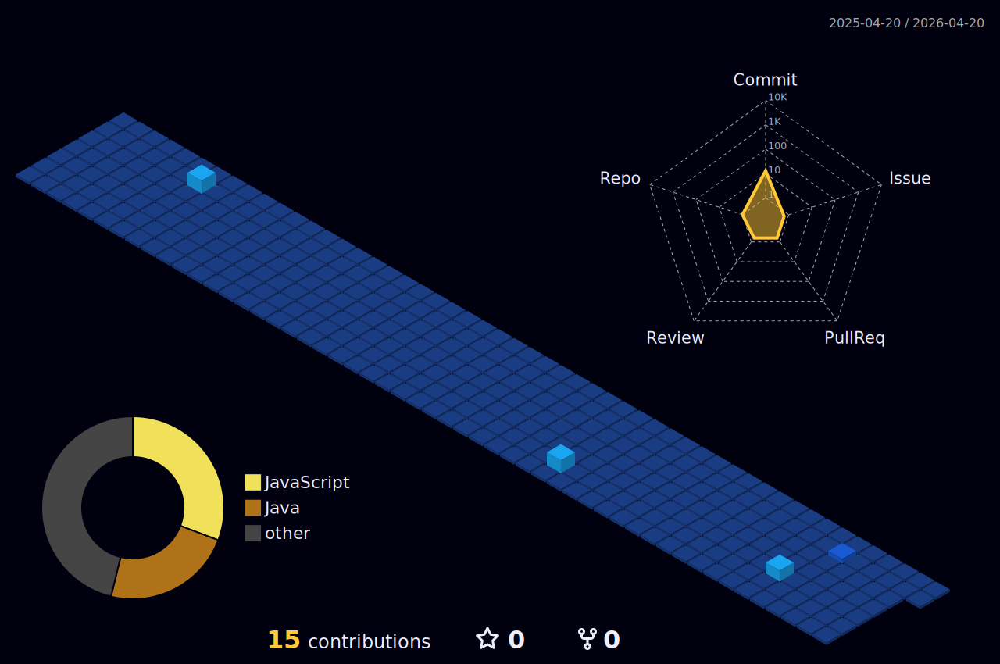

# Bem-vindo(a) ao meu perfil  👾

Olá, meu nome é Pedro!

Sobre mim

- 🤔 Descobrindo novas tecnologias e criando soluções.
- 🎓 Estudando Ciências da Computação na PUC minas.

### ⚙️ GitHub Analytics

<table>
  <tr>
    <td>
      
    </td>
    <td>
       
      
    </td>
  </tr>
</table>

<table>
  <tr>
    <td>
      
    </td>
      </tr>
</table>
 
 

# 🌟 Meu GitHub em 3D

Veja abaixo meu calendário de contribuições em 3D!

 
### Pra mais contato, segue as redes aqui em baixo!
 

 
  
  
  

